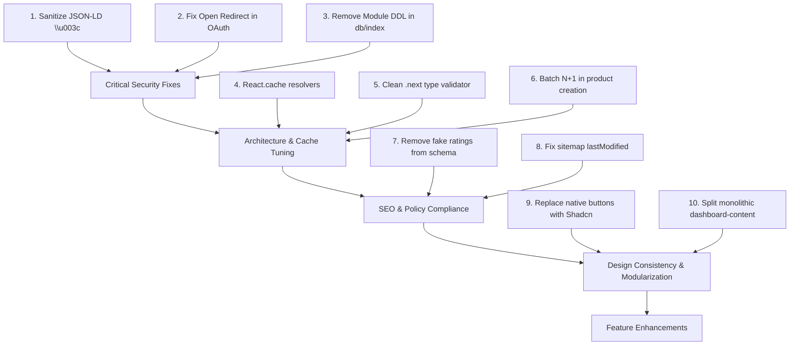

# Comprehensive Application Audit Report: LaunchNests (BuyMyNextLaunch)

**Audit Date:** September 18, 2026  
**Stack:** Next.js 16.2.6 (App Router / Turbopack), React 19.2.4, TypeScript 5, Tailwind CSS v4, Drizzle ORM (Neon PostgreSQL), Better Auth 1.7, TanStack React Query 5, Axios, Shadcn UI.  
**Scope:** Full repository security assessment, architectural performance analysis, design consistency, SEO / AEO / GEO audits, and operational feature evaluation.

---

## Executive Summary Matrix

| Category | High Severity | Medium Severity | Low / Info | Status |
| :--- | :---: | :---: | :---: | :--- |
| **1. Vulnerabilities & Security Issues** | 2 | 4 | 2 | ⚠️ Action Required |
| **2. Architecture & Code Performance** | 1 | 4 | 3 | ⚠️ Optimizations Needed |
| **3. Design & UI Inconsistencies** | 0 | 4 | 3 | 🛠️ Cleanup Required |
| **4. SEO, AEO & GEO Optimization** | 1 | 3 | 2 | ⚠️ Policy & Tuning Needed |
| **5. Operational & Feature Improvements** | 0 | 4 | 2 | 💡 Strategic Enhancements |

---

# 1. Vulnerabilities & Security Issues

### 1.1 [HIGH] Stored Cross-Site Scripting (XSS) via Unescaped JSON-LD Injections
- **Files Affected:**
  - [`app/products/[slug]/page.tsx`](file:///c:/Users/HP/Desktop/Engagement/BuyMyNextLaunch/app/products/[slug]/page.tsx#L221)
  - [`app/tools/[slug]/page.tsx`](file:///c:/Users/HP/Desktop/Engagement/BuyMyNextLaunch/app/tools/[slug]/page.tsx#L243)
  - [`app/makers/[username]/page.tsx`](file:///c:/Users/HP/Desktop/Engagement/BuyMyNextLaunch/app/makers/[username]/page.tsx#L156)
- **Vulnerability Mechanics:**
  User-submitted content (product descriptions, problem statements, solutions, unique value propositions, maker bios, and custom FAQs) is serialized directly using native `JSON.stringify()` and embedded inside an inline `<script type="application/ld+json">`:
  ```tsx
  <script
    type="application/ld+json"
    dangerouslySetInnerHTML={{ __html: JSON.stringify(prodJsonLd) }}
  />
  ```
  In standard HTML specifications, the browser HTML parser checks for the literal sequence `</script>` *before* JavaScript/JSON parsing. If a user submits a description containing:
  `</script><script>alert(document.cookie)</script>`
  `JSON.stringify` does **not** escape `<` or `</script>`. When rendered on the server into the HTML response, the browser immediately terminates the JSON-LD block and executes the injected script.
- **Impact:** Complete account takeover, session token harvesting, or unauthorized actions performed in victim browser contexts.
- **Remediation:**
  Create a safe JSON-LD serializer in `lib/seo/schema.ts`:
  ```ts
  export const safeJsonLd = (data: unknown): string =>
    JSON.stringify(data).replace(/</g, "\\u003c")
  ```
  Replace all `JSON.stringify` calls in `<script type="application/ld+json">` with `safeJsonLd(...)`.

---

### 1.2 [HIGH] Open Redirect Vulnerability in OAuth Callback Handling
- **Files Affected:**
  - [`components/auth/auth-modal-provider.tsx`](file:///c:/Users/HP/Desktop/Engagement/BuyMyNextLaunch/components/auth/auth-modal-provider.tsx#L43-L57)
  - [`components/auth/auth-dialog.tsx`](file:///c:/Users/HP/Desktop/Engagement/BuyMyNextLaunch/components/auth/auth-dialog.tsx#L65-L68)
- **Vulnerability Mechanics:**
  The `redirect` URL search parameter is extracted directly from the query string without domain or schema verification:
  ```ts
  const redirectPath = searchParams.get("redirect")
  if (redirectPath) {
    openAuthModal({ redirectTo: redirectPath })
  }
  ```
  This is subsequently passed to Better Auth's `signIn.social({ callbackURL: redirectTo })` as well as client-side `router.push(options.redirectTo)`.
  An attacker can craft a link such as:
  `https://launchnests.com/?redirect=https://evil-phishing-portal.com` or `https://launchnests.com/?redirect=//evil.com`
  After completing Google authentication, the user is forwarded directly to the malicious third-party site.
- **Impact:** Credential theft via authenticated phishing redirection.
- **Remediation:**
  Enforce relative internal path validation:
  ```ts
  const sanitizeRedirect = (url: string | null): string => {
    if (!url || !url.startsWith("/") || url.startsWith("//")) return "/"
    return url
  }
  ```

---

### 1.3 [MEDIUM] Ephemeral In-Memory Rate Limiting in Serverless Architecture
- **Files Affected:**
  - [`lib/rate-limit.ts`](file:///c:/Users/HP/Desktop/Engagement/BuyMyNextLaunch/lib/rate-limit.ts#L6)
  - [`middleware.ts`](file:///c:/Users/HP/Desktop/Engagement/BuyMyNextLaunch/middleware.ts#L80-L99)
- **Vulnerability Mechanics:**
  The rate limiter stores hits in an in-memory `Map<string, RateLimitRecord>()`. In serverless deployments (Vercel Edge/Node Lambdas), memory is isolated per container instance and wiped upon cold starts.
  An attacker or automated bot scraper hitting endpoints across concurrent requests will hit different serverless instances, easily bypassing the 10-60 req/min limits.
- **Remediation:**
  Migrate rate limiting to a shared Redis store using `@upstash/ratelimit` and `@upstash/redis` for global distributed enforcement.

---

### 1.4 [MEDIUM] Client IP Spoofing in Rate Limiter Header Parsing
- **Files Affected:**
  - [`middleware.ts`](file:///c:/Users/HP/Desktop/Engagement/BuyMyNextLaunch/middleware.ts#L5-L8)
- **Vulnerability Mechanics:**
  ```ts
  const getClientIp = (request: NextRequest) =>
    request.headers.get("x-forwarded-for")?.split(",")[0]?.trim() ||
    request.headers.get("x-real-ip") ||
    "127.0.0.1"
  ```
  `x-forwarded-for` is client-controlled unless the outer proxy strips incoming headers. If a client sends:
  `X-Forwarded-For: 10.0.0.1, 10.0.0.2`
  The first IP `10.0.0.1` is evaluated. An attacker can rotate fake IP headers on every request to completely evade rate limiting.
- **Remediation:**
  Use Next.js / Vercel's trusted IP:
  ```ts
  const getClientIp = (request: NextRequest) =>
    request.ip ||
    request.headers.get("x-real-ip") ||
    "127.0.0.1"
  ```

---

### 1.5 [MEDIUM] Unmoderated Instant Auto-Approval on New Product / Tool Submissions
- **Files Affected:**
  - [`db/queries/products/create.ts`](file:///c:/Users/HP/Desktop/Engagement/BuyMyNextLaunch/db/queries/products/create.ts#L62)
  - [`db/queries/tools/create.ts`](file:///c:/Users/HP/Desktop/Engagement/BuyMyNextLaunch/db/queries/tools/create.ts)
- **Vulnerability Mechanics:**
  Upon inserting a new product or tool into PostgreSQL, `status` is hardcoded to `"approved"`:
  ```ts
  const [product] = await db.insert(products).values({
    ...rest,
    status: "approved",
  })
  ```
  Any authenticated Google user can immediately publish malicious external links, phishing domains, or spam campaigns that instantly appear on the homepage, trending page, and sitemap.
- **Remediation:**
  Set initial status to `"pending"` or implement automated domain reputation verification before publishing.

---

### 1.6 [MEDIUM] Unprotected Cold Start DDL Execution Spams Database
- **Files Affected:**
  - [`db/index.ts`](file:///c:/Users/HP/Desktop/Engagement/BuyMyNextLaunch/db/index.ts#L9-L23)
- **Vulnerability Mechanics:**
  ```ts
  sql`ALTER TABLE "accounts" ADD COLUMN IF NOT EXISTS "issuer" text NOT NULL DEFAULT 'google';`.catch(() => {})
  sql`CREATE UNIQUE INDEX IF NOT EXISTS "accounts_providerId_accountId_uidx" ...`.catch(() => {})
  ```
  These DDL statements execute unconditionally in the module root of `db/index.ts`. Every single cold start of an API route, page render, or background cron triggers 5 un-awaited DDL queries against Neon PostgreSQL, causing connection saturation, DDL locks, and potential deadlock spikes under traffic.
- **Remediation:**
  Execute schema changes through `pnpm db:migrate` or `drizzle-kit push` and remove raw DDL from `db/index.ts`.

---

### 1.7 [LOW] Missing Content-Security-Policy (CSP) Header
- **Files Affected:**
  - [`next.config.ts`](file:///c:/Users/HP/Desktop/Engagement/BuyMyNextLaunch/next.config.ts#L36-L54)
- **Vulnerability Mechanics:**
  `next.config.ts` includes `X-Frame-Options: DENY`, `X-Content-Type-Options: nosniff`, and `Strict-Transport-Security`, but completely omits `Content-Security-Policy`. Without CSP, there is no defense-in-depth against unauthorized inline scripts, object embeddings, or rogue script endpoints.
- **Remediation:**
  Add a strict CSP header in `next.config.ts` allowing trusted domains (`https://accounts.google.com`, `https://va.vercel-scripts.com`, etc.).

---

### 1.8 [LOW] Missing Preflight CORS Support on Model Context Protocol (MCP) Route
- **Files Affected:**
  - [`app/api/mcp/route.ts`](file:///c:/Users/HP/Desktop/Engagement/BuyMyNextLaunch/app/api/mcp/route.ts#L1-L15)
- **Issue:**
  The endpoint only exports `POST`. Browser-based AI agents, Cursor web views, and external web clients sending preflight `OPTIONS` requests fail with a 405 Method Not Allowed error.
- **Remediation:**
  Export an `OPTIONS` handler with appropriate CORS headers (`Access-Control-Allow-Origin: *`, `Access-Control-Allow-Methods: POST, OPTIONS`).

---

# 2. Architecture, Performance & Code Quality

### 2.1 [CRITICAL] Stale Route Artifacts Breaking TypeScript Typecheck
- **Files Affected:**
  - [`.next/types/validator.ts`](file:///c:/Users/HP/Desktop/Engagement/BuyMyNextLaunch/tsconfig.json#L31-L32)
- **Root Cause:**
  `pnpm typecheck` (`tsc --noEmit`) fails with:
  `Cannot find module '../../app/discover/rising-tools/page.js'`.
  The `/discover/rising-tools` folder was deleted and redirected in `next.config.ts`, but stale Next.js route type bindings remain inside `.next/types`. Because `tsconfig.json` includes `.next/types/**/*.ts`, stale build caches block clean type checks.
- **Remediation:**
  Add a pre-typecheck script or clean step (`rimraf .next`) before typechecking, or update `tsconfig.json` to only validate active source trees.

---

### 2.2 [HIGH] Duplicate Uncached Database Resolvers per Page Request (`server-cache-react`)
- **Files Affected:**
  - [`lib/products/resolve-product.ts`](file:///c:/Users/HP/Desktop/Engagement/BuyMyNextLaunch/lib/products/resolve-product.ts#L30)
  - [`lib/tools/resolve-tool.ts`](file:///c:/Users/HP/Desktop/Engagement/BuyMyNextLaunch/lib/tools/resolve-tool.ts#L32)
  - [`app/products/[slug]/page.tsx`](file:///c:/Users/HP/Desktop/Engagement/BuyMyNextLaunch/app/products/[slug]/page.tsx#L81,L143)
  - [`app/tools/[slug]/page.tsx`](file:///c:/Users/HP/Desktop/Engagement/BuyMyNextLaunch/app/tools/[slug]/page.tsx#L152)
- **Rule Violated:** Vercel Engineering Guideline `server-cache-react`.
- **Mechanics:**
  In Next.js App Router, `generateMetadata()` and the main page Server Component execute in the same request lifecycle. Neither `resolveProduct` nor `resolveTool` wraps queries with `React.cache()`. As a result, every single product or tool page load issues **two identical queries** to PostgreSQL.
- **Remediation:**
  ```ts
  import { cache } from "react"
  export const resolveProduct = cache(async (slug: string): Promise<FullProduct | null> => {
    // query logic
  })
  ```

---

### 2.3 [HIGH] N+1 Database Waterfall in Product Tool Linking
- **Files Affected:**
  - [`db/queries/products/create.ts`](file:///c:/Users/HP/Desktop/Engagement/BuyMyNextLaunch/db/queries/products/create.ts#L67-L108)
- **Rule Violated:** Vercel Guideline `async-parallel` & `server-parallel-nested-fetching`.
- **Mechanics:**
  Inside `createProduct`, linked tools are processed sequentially inside a `for...of` loop:
  ```ts
  for (const item of toolsToLink) {
    await db.select(...) // lookup
    await db.insert(...) // link
    await db.update(...) // increment count
  }
  ```
  If a product links 8 tools, this issues up to 24 sequential, blocking database network roundtrips.
- **Remediation:**
  Batch tool lookups using `inArray()`, perform a single multi-row `insert(productTools)`, and batch increment counter updates.

---

### 2.4 [MEDIUM] In-Memory Sitemap Loading 15,000 DB Rows Without Pagination
- **Files Affected:**
  - [`app/sitemap.ts`](file:///c:/Users/HP/Desktop/Engagement/BuyMyNextLaunch/app/sitemap.ts#L151-L158)
- **Mechanics:**
  The sitemap query requests:
  `getProducts({ limit: 5000 })`, `getTools({ limit: 5000 })`, and `getAllMakers(5000)`.
  Generating `/sitemap.xml` attempts to load up to 15,000 complete objects into a single serverless Lambda execution. Under moderate catalog growth, this will trigger `504 Gateway Timeout` or `Out of Memory (OOM)` errors.
- **Remediation:**
  Use Next.js Sitemap Index partitioning (`generateSitemaps`) and project only necessary fields (`slug`, `updatedAt`).

---

### 2.5 [MEDIUM] Side-Effect Database Mutation Inside Idempotent Profile Read (`GET`)
- **Files Affected:**
  - [`db/queries/users/get-profile.ts`](file:///c:/Users/HP/Desktop/Engagement/BuyMyNextLaunch/db/queries/users/get-profile.ts#L187-L210)
  - [`app/api/users/profile/route.ts`](file:///c:/Users/HP/Desktop/Engagement/BuyMyNextLaunch/app/api/users/profile/route.ts#L20)
- **Mechanics:**
  `getCurrentUserProfile()` performs an `UPDATE` on the `users` table if `username` or `country` is missing. This violates HTTP idempotent semantics for `GET` requests and causes unwanted database writes during search engine or crawler requests.
- **Remediation:**
  Handle username/country assignment during initial registration or in a dedicated initialization/profile setup step.

---

### 2.6 [MEDIUM] Bypassing Next.js Image Optimization via `unoptimized`
- **Files Affected:**
  - [`components/shared/product-logo.tsx`](file:///c:/Users/HP/Desktop/Engagement/BuyMyNextLaunch/components/shared/product-logo.tsx#L39)
  - [`next.config.ts`](file:///c:/Users/HP/Desktop/Engagement/BuyMyNextLaunch/next.config.ts)
- **Mechanics:**
  `<Image src={imageUrl} unoptimized />` disables Next.js automatic WebP/AVIF format conversion, responsive image srcset generation, and image resizing. Remote assets are served at full raw resolution, inflating page weight and degrading Largest Contentful Paint (LCP).
- **Remediation:**
  Configure `images.remotePatterns` in `next.config.ts` and remove `unoptimized`.

---

### 2.7 [LOW] Unused Downloaded Font Inflating Initial Asset Payloads
- **Files Affected:**
  - [`app/layout.tsx`](file:///c:/Users/HP/Desktop/Engagement/BuyMyNextLaunch/app/layout.tsx#L88,L109)
  - [`app/globals.css`](file:///c:/Users/HP/Desktop/Engagement/BuyMyNextLaunch/app/globals.css#L5-L7,L94)
- **Mechanics:**
  `Geist` sans is imported and loaded as `--font-sans`. However, in `globals.css`, `html` is forced to `@apply font-mono` and `--font-heading` is mapped to `var(--font-mono)`. The sans-serif font is downloaded over the network but never rendered.
- **Remediation:**
  Either remove `Geist` or properly assign it to body text and keep `Geist_Mono` for code/badges.

---

# 3. Design & UI Inconsistencies

### 3.1 [MEDIUM] Native `<button>` Usage Violating Project Architectural Guidelines
- **Files Affected:**
  - [`components/home/launches-tabs-section.tsx`](file:///c:/Users/HP/Desktop/Engagement/BuyMyNextLaunch/components/home/launches-tabs-section.tsx#L61,L98)
  - [`components/products/products-filter-bar.tsx`](file:///c:/Users/HP/Desktop/Engagement/BuyMyNextLaunch/components/products/products-filter-bar.tsx#L45,L60)
  - [`components/tools/tools-filter-bar.tsx`](file:///c:/Users/HP/Desktop/Engagement/BuyMyNextLaunch/components/tools/tools-filter-bar.tsx#L45,L60)
  - [`components/dashboard/dashboard-content.tsx`](file:///c:/Users/HP/Desktop/Engagement/BuyMyNextLaunch/components/dashboard/dashboard-content.tsx#L270,L281,L292)
  - [`components/shared/built-with-tools-input.tsx`](file:///c:/Users/HP/Desktop/Engagement/BuyMyNextLaunch/components/shared/built-with-tools-input.tsx#L208,L278,L330)
- **Rule Violated:** `AGENTS.md`: *"Use shadcn/ui for every UI element... Never use native HTML elements (`<button>`, `<input>`, `<select>`) or build from scratch when a shadcn component exists."*
- **Issue:**
  The project already has `components/ui/button.tsx`, `tabs.tsx`, and `toggle.tsx` installed. Yet raw HTML `<button>` elements with inline custom classes are used for tabs, filter chips, and interactive badges.
- **Remediation:**
  Refactor all raw `<button>` elements to use `<Button variant="..." size="...">` or Shadcn `<TabsList>` / `<TabsTrigger>`.

---

### 3.2 [MEDIUM] Monolithic Dashboard Component (1,119 Lines)
- **Files Affected:**
  - [`components/dashboard/dashboard-content.tsx`](file:///c:/Users/HP/Desktop/Engagement/BuyMyNextLaunch/components/dashboard/dashboard-content.tsx) (43.9 KB)
- **Rule Violated:** `AGENTS.md`: *"Keep logic modular, reusable, and separated by responsibility."*
- **Issue:**
  This single file manages:
  - Metric summary cards
  - Submissions list & status toggling
  - Delete dialogs & modals
  - Edit forms
  - Comment thread viewing
  - Search filtering & pagination
- **Remediation:**
  Decompose into:
  - `components/dashboard/dashboard-stats.tsx`
  - `components/dashboard/submissions-table.tsx`
  - `components/dashboard/comments-list.tsx`
  - `components/dashboard/status-filter-bar.tsx`

---

### 3.3 [MEDIUM] Half-Implemented Dark Mode State
- **Files Affected:**
  - [`app/globals.css`](file:///c:/Users/HP/Desktop/Engagement/BuyMyNextLaunch/app/globals.css)
  - [`app/providers.tsx`](file:///c:/Users/HP/Desktop/Engagement/BuyMyNextLaunch/app/providers.tsx)
  - [`package.json`](file:///c:/Users/HP/Desktop/Engagement/BuyMyNextLaunch/package.json#L33)
- **Issue:**
  `next-themes` is installed in `package.json`, but:
  1. `ThemeProvider` is never mounted in `Providers`.
  2. `globals.css` only defines `:root` colors; there is no `.dark` palette defined.
  Any client attempting to toggle dark mode results in broken contrast and unreadable text.
- **Remediation:**
  Either fully configure Shadcn dark mode variables in `globals.css` and mount `ThemeProvider`, or uninstall `next-themes` to eliminate dead dependencies.

---

### 3.4 [MEDIUM] Domain Metric Inconsistency: "Upvotes" vs "Likes"
- **Files Affected:**
  - [`components/products/products-filter-bar.tsx`](file:///c:/Users/HP/Desktop/Engagement/BuyMyNextLaunch/components/products/products-filter-bar.tsx#L45-L58)
  - [`app/api/products/route.ts`](file:///c:/Users/HP/Desktop/Engagement/BuyMyNextLaunch/app/api/products/route.ts#L31)
  - [`db/schema.ts`](file:///c:/Users/HP/Desktop/Engagement/BuyMyNextLaunch/db/schema.ts#L230)
- **Issue:**
  Tools use `upvotesCount` (`toolUpvotes`), while products use `likesCount` (`productLikes`).
  However, in `ProductsFilterBar`, the button label says **"Upvoted"** with an `ArrowBigUp` icon, and the API has to silently transform `sortBy: "upvotes"` into `"likes"`.
- **Remediation:**
  Unify the terminology across the UI: either use "Likes" (with heart icon) for products and "Upvotes" for tools, or unify the database domain concept across both entities.

---

### 3.5 [LOW] Ad-Hoc Empty States Instead of Reusable Shadcn Empty Component
- **Files Affected:**
  - [`components/home/launches-tabs-section.tsx`](file:///c:/Users/HP/Desktop/Engagement/BuyMyNextLaunch/components/home/launches-tabs-section.tsx#L29-L34)
  - [`components/dashboard/dashboard-content.tsx`](file:///c:/Users/HP/Desktop/Engagement/BuyMyNextLaunch/components/dashboard/dashboard-content.tsx#L312-L320)
- **Issue:**
  Inline divs with custom borders and muted text are written by hand, ignoring the existing [`components/ui/empty.tsx`](file:///c:/Users/HP/Desktop/Engagement/BuyMyNextLaunch/components/ui/empty.tsx) component.
- **Remediation:**
  Replace with `<Empty>`, `<EmptyHeader>`, `<EmptyTitle>`, and `<EmptyDescription>`.

---

### 3.6 [LOW] Asymmetric Slug Fallback Redirection
- **Files Affected:**
  - [`app/products/[slug]/page.tsx`](file:///c:/Users/HP/Desktop/Engagement/BuyMyNextLaunch/app/products/[slug]/page.tsx#L146-L149)
  - [`app/tools/[slug]/page.tsx`](file:///c:/Users/HP/Desktop/Engagement/BuyMyNextLaunch/app/tools/[slug]/page.tsx#L154)
- **Issue:**
  If a visitor navigates to `/products/[slug]` and the slug belongs to a tool, the page smoothly redirects to `/tools/[slug]`. However, if a visitor requests `/tools/[slug]` for a product, it immediately renders `notFound()` (404) without checking if a matching product exists.
- **Remediation:**
  Add mirror fallback resolution in `ToolDetailPage`.

---

# 4. SEO, AEO (AI Engine Optimization) & GEO Issues

### 4.1 [HIGH] Fabricated Aggregate Ratings Violating Google Search Policies
- **Files Affected:**
  - [`lib/seo/schema.ts`](file:///c:/Users/HP/Desktop/Engagement/BuyMyNextLaunch/lib/seo/schema.ts#L110-L113,L167-L172)
- **Issue:**
  ```ts
  const ratingValue = count > 0 ? Math.min(5, Math.max(4.2, 4 + count / 1000)).toFixed(1) : "4.8"
  const ratingCount = Math.max(1, count > 0 ? count : 12)
  ```
  When a product has zero upvotes or reviews, the schema generator fabricates a synthetic rating of **4.8 stars** and **12 ratings**.
  Google Search Central guidelines state:
  > *"Do not provide aggregate ratings that are fabricated or not directly based on actual user reviews."*
  Sites generating synthetic ratings are subject to Google Manual Actions ("Spammy structured markup") which can revoke rich snippets or derank the domain.
- **Remediation:**
  Only include `aggregateRating` when genuine ratings exist (`count > 0`). When count is 0, omit the `aggregateRating` property entirely.

---

### 4.2 [MEDIUM] Non-Deterministic `lastModified` on Static Sitemap Entries
- **Files Affected:**
  - [`app/sitemap.ts`](file:///c:/Users/HP/Desktop/Engagement/BuyMyNextLaunch/app/sitemap.ts#L27,L33,L39,etc.)
- **Issue:**
  Every static route in `sitemap.ts` sets `lastModified: new Date()`. Every time Googlebot, Bingbot, or Perplexity requests `/sitemap.xml`, every static route reports that it was modified *seconds ago*. This invalidates search engine crawl caching and exhausts crawl budgets.
- **Remediation:**
  Use the deployment timestamp or static release date (e.g. `new Date("2026-09-01")`) for static pages.

---

### 4.3 [MEDIUM] Deprecated / Redirected Routes Retained in Route Constants
- **Files Affected:**
  - [`constants/routes.ts`](file:///c:/Users/HP/Desktop/Engagement/BuyMyNextLaunch/constants/routes.ts#L3-L9)
  - [`app/sitemap.ts`](file:///c:/Users/HP/Desktop/Engagement/BuyMyNextLaunch/app/sitemap.ts#L50,L62)
- **Issue:**
  Routes such as `/discover/new-rising`, `/discover/rising-tools`, and `/discover/daily-launches` have permanent 308 redirects in `next.config.ts`. Retaining them in `ROUTES` risks developers accidentally linking to redirected paths, creating unnecessary HTTP redirect hops that degrade Core Web Vitals.
- **Remediation:**
  Purge obsolete routes from `ROUTES` and update all internal links to their target destinations.

---

### 4.4 [LOW] Incomplete Crawl Protection in `robots.ts`
- **Files Affected:**
  - [`app/robots.ts`](file:///c:/Users/HP/Desktop/Engagement/BuyMyNextLaunch/app/robots.ts#L10,L22,L51)
- **Issue:**
  `robots.ts` disallows `["/api/users", "/api/auth/", "/admin/", "/dashboard/"]`.
  However, it leaves endpoints like `/api/seed`, `/api/builds`, `/api/products` (POST), and internal utility routes exposed to crawler traffic.
- **Remediation:**
  Disallow `/api/` entirely, while explicitly allowing AI-facing endpoints:
  ```ts
  disallow: ["/api/", "/dashboard/"],
  allow: ["/api/mcp", "/api/md/", "/api/ai"],
  ```

---

# 5. Operational & Feature Improvements

### 5.1 [MEDIUM] Absence of User Self-Service Edit / Delete for Submissions
- **Files Affected:**
  - [`app/api/products/[slug]/route.ts`](file:///c:/Users/HP/Desktop/Engagement/BuyMyNextLaunch/app/api/products/[slug]/route.ts)
  - [`app/api/tools/[slug]/route.ts`](file:///c:/Users/HP/Desktop/Engagement/BuyMyNextLaunch/app/api/tools/[slug]/route.ts)
- **Issue:**
  There are zero `PATCH`, `PUT`, or `DELETE` endpoints for products, tools, comments, or builds. If a maker notices a broken link, outdated tagline, or wrong tag, they have no self-service ability to update their submission.
- **Remediation:**
  Implement authenticated ownership-checked `PATCH` and `DELETE` handlers verifying `session.user.id === product.submitterId`.

---

### 5.2 [MEDIUM] Divergence Between Pricing Page and Plan Constants
- **Files Affected:**
  - [`app/pricing/page.tsx`](file:///c:/Users/HP/Desktop/Engagement/BuyMyNextLaunch/app/pricing/page.tsx)
  - [`constants/plans.ts`](file:///c:/Users/HP/Desktop/Engagement/BuyMyNextLaunch/constants/plans.ts#L77-L141)
- **Issue:**
  `constants/plans.ts` defines subscription listings:
  - Free ($0)
  - Featured Builder ($49)
  - Ecosystem Partner ($149)
  With call-to-actions linking to `/submit`.
  In contrast, `app/pricing/page.tsx` is completely dedicated to "Sidebar Sponsorship & Advertising" with instructions to "DM on X".
  This causes confusion regarding whether LaunchNests offers paid listing tiers, advertising spots, or both.
- **Remediation:**
  Harmonize `pricing/page.tsx` to feature both Product Listing Tiers (with clear Stripe/checkout or submission integration) and Sidebar Sponsorship slots.

---

### 5.3 [MEDIUM] Zero Automated Testing Infrastructure
- **Files Affected:**
  - [`package.json`](file:///c:/Users/HP/Desktop/Engagement/BuyMyNextLaunch/package.json)
- **Issue:**
  There is no test framework (Vitest, Jest, Playwright) installed or configured. Regression prevention relies entirely on manual verification.
- **Remediation:**
  Install Vitest for unit testing schema validation and API routes, and Playwright for critical E2E user flows (Google OAuth login, submission flow, search & filter).

---

# 6. Prioritized Remediation Roadmap



### Immediate Action Items (Next Sprint)
1. **Sanitize JSON-LD Output**: Apply `safeJsonLd()` across all metadata components to eradicate stored XSS vectors.
2. **Harden Redirect Parameter**: Validate OAuth return paths to disallow external schemas and protocol-relative URLs (`//`).
3. **Remove Module DDL**: Delete `ALTER TABLE` / `CREATE INDEX` queries from `db/index.ts`.
4. **Wrap Resolvers with `React.cache()`**: Prevent duplicate database queries between `generateMetadata` and Server Component renders.
5. **Fix Aggregate Rating Schema**: Remove synthetic fallback reviews to protect the domain from Google search penalties.
6. **Refactor Native `<button>` Elements**: Convert to Shadcn `<Button>` and `<Tabs>` across filter bars and dashboard views.
